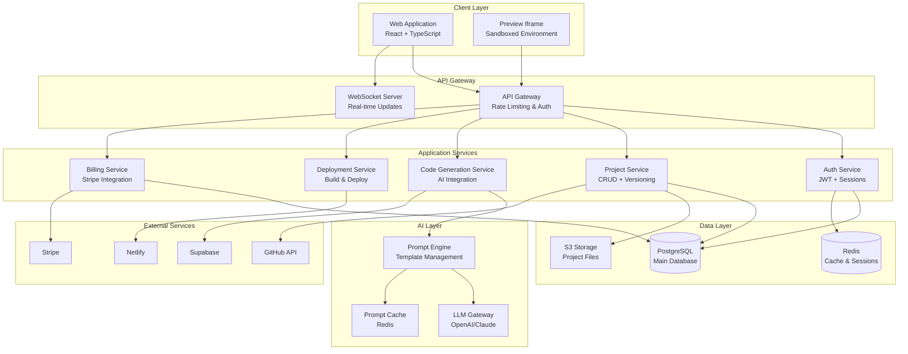
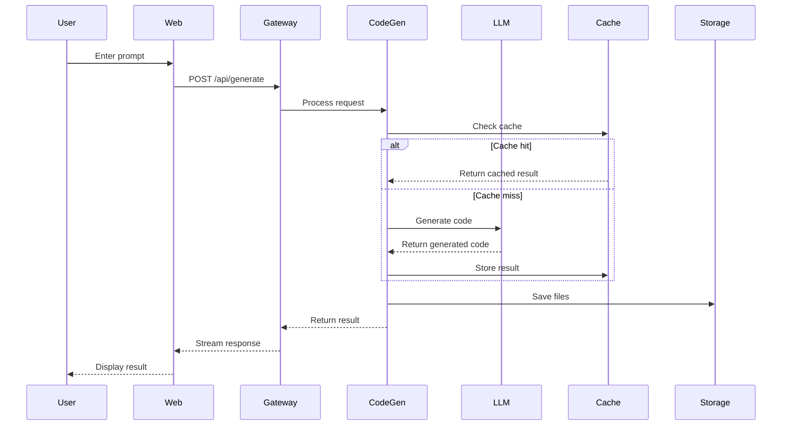
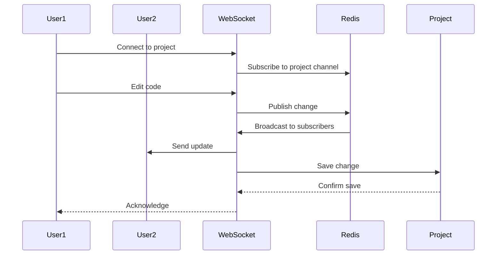
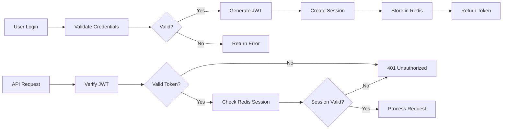
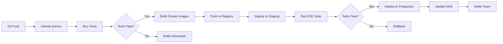

# Ultracode System Architecture

## High-Level Architecture Overview



## Component Architecture

### 1. Frontend Architecture

```
ultracode-web/
├── src/
│   ├── components/
│   │   ├── chat/
│   │   │   ├── ChatInterface.tsx
│   │   │   ├── MessageList.tsx
│   │   │   ├── InputBox.tsx
│   │   │   └── CodeBlock.tsx
│   │   ├── editor/
│   │   │   ├── MonacoEditor.tsx
│   │   │   ├── FileTree.tsx
│   │   │   ├── TabManager.tsx
│   │   │   └── EditorToolbar.tsx
│   │   ├── preview/
│   │   │   ├── PreviewFrame.tsx
│   │   │   ├── DeviceSelector.tsx
│   │   │   ├── ConsoleOutput.tsx
│   │   │   └── NetworkMonitor.tsx
│   │   └── project/
│   │       ├── ProjectDashboard.tsx
│   │       ├── ProjectCard.tsx
│   │       ├── DeploymentStatus.tsx
│   │       └── ShareDialog.tsx
│   ├── hooks/
│   │   ├── useWebSocket.ts
│   │   ├── useProject.ts
│   │   ├── useCodeGeneration.ts
│   │   └── useAuth.ts
│   ├── services/
│   │   ├── api.ts
│   │   ├── websocket.ts
│   │   ├── storage.ts
│   │   └── analytics.ts
│   ├── store/
│   │   ├── authStore.ts
│   │   ├── projectStore.ts
│   │   ├── chatStore.ts
│   │   └── editorStore.ts
│   └── utils/
│       ├── codeParser.ts
│       ├── promptBuilder.ts
│       ├── errorHandler.ts
│       └── validators.ts
```

### 2. Backend Microservices Architecture

```
ultracode-api/
├── gateway/
│   ├── src/
│   │   ├── middleware/
│   │   │   ├── auth.ts
│   │   │   ├── rateLimit.ts
│   │   │   ├── cors.ts
│   │   │   └── logging.ts
│   │   ├── routes/
│   │   │   ├── auth.routes.ts
│   │   │   ├── project.routes.ts
│   │   │   ├── codegen.routes.ts
│   │   │   └── billing.routes.ts
│   │   └── server.ts
│   └── Dockerfile
├── services/
│   ├── auth-service/
│   │   ├── src/
│   │   │   ├── controllers/
│   │   │   ├── models/
│   │   │   ├── services/
│   │   │   └── utils/
│   │   └── Dockerfile
│   ├── project-service/
│   │   ├── src/
│   │   │   ├── controllers/
│   │   │   ├── models/
│   │   │   ├── repositories/
│   │   │   └── services/
│   │   └── Dockerfile
│   ├── codegen-service/
│   │   ├── src/
│   │   │   ├── generators/
│   │   │   ├── templates/
│   │   │   ├── validators/
│   │   │   └── optimizers/
│   │   └── Dockerfile
│   └── deployment-service/
│       ├── src/
│       │   ├── builders/
│       │   ├── deployers/
│       │   ├── monitors/
│       │   └── rollback/
│       └── Dockerfile
```

## Data Flow Architecture

### 1. Code Generation Flow



### 2. Real-time Collaboration Flow



## Database Schema

### Core Tables

```sql
-- Users table
CREATE TABLE users (
    id UUID PRIMARY KEY DEFAULT gen_random_uuid(),
    email VARCHAR(255) UNIQUE NOT NULL,
    password_hash VARCHAR(255),
    full_name VARCHAR(255),
    avatar_url VARCHAR(255),
    role VARCHAR(50) DEFAULT 'user',
    email_verified BOOLEAN DEFAULT false,
    created_at TIMESTAMP DEFAULT CURRENT_TIMESTAMP,
    updated_at TIMESTAMP DEFAULT CURRENT_TIMESTAMP
);

-- Projects table
CREATE TABLE projects (
    id UUID PRIMARY KEY DEFAULT gen_random_uuid(),
    user_id UUID REFERENCES users(id) ON DELETE CASCADE,
    name VARCHAR(255) NOT NULL,
    description TEXT,
    visibility VARCHAR(50) DEFAULT 'private',
    tech_stack JSONB,
    deployment_url VARCHAR(255),
    github_repo VARCHAR(255),
    created_at TIMESTAMP DEFAULT CURRENT_TIMESTAMP,
    updated_at TIMESTAMP DEFAULT CURRENT_TIMESTAMP,
    last_accessed TIMESTAMP DEFAULT CURRENT_TIMESTAMP
);

-- Project files table
CREATE TABLE project_files (
    id UUID PRIMARY KEY DEFAULT gen_random_uuid(),
    project_id UUID REFERENCES projects(id) ON DELETE CASCADE,
    path VARCHAR(500) NOT NULL,
    content TEXT,
    type VARCHAR(50),
    size INTEGER,
    created_at TIMESTAMP DEFAULT CURRENT_TIMESTAMP,
    updated_at TIMESTAMP DEFAULT CURRENT_TIMESTAMP,
    UNIQUE(project_id, path)
);

-- Chat sessions table
CREATE TABLE chat_sessions (
    id UUID PRIMARY KEY DEFAULT gen_random_uuid(),
    project_id UUID REFERENCES projects(id) ON DELETE CASCADE,
    user_id UUID REFERENCES users(id) ON DELETE CASCADE,
    messages JSONB,
    context JSONB,
    tokens_used INTEGER DEFAULT 0,
    created_at TIMESTAMP DEFAULT CURRENT_TIMESTAMP,
    updated_at TIMESTAMP DEFAULT CURRENT_TIMESTAMP
);

-- Deployments table
CREATE TABLE deployments (
    id UUID PRIMARY KEY DEFAULT gen_random_uuid(),
    project_id UUID REFERENCES projects(id) ON DELETE CASCADE,
    provider VARCHAR(50),
    status VARCHAR(50),
    url VARCHAR(255),
    build_logs TEXT,
    deployed_at TIMESTAMP,
    created_at TIMESTAMP DEFAULT CURRENT_TIMESTAMP
);

-- Billing table
CREATE TABLE billing (
    id UUID PRIMARY KEY DEFAULT gen_random_uuid(),
    user_id UUID REFERENCES users(id) ON DELETE CASCADE,
    plan_type VARCHAR(50) DEFAULT 'free',
    credits_remaining INTEGER DEFAULT 5,
    credits_used INTEGER DEFAULT 0,
    stripe_customer_id VARCHAR(255),
    stripe_subscription_id VARCHAR(255),
    current_period_end TIMESTAMP,
    created_at TIMESTAMP DEFAULT CURRENT_TIMESTAMP,
    updated_at TIMESTAMP DEFAULT CURRENT_TIMESTAMP
);
```

## Security Architecture

### 1. Authentication Flow



### 2. Security Layers

- **API Gateway**: Rate limiting, DDoS protection
- **Authentication**: JWT + refresh tokens
- **Authorization**: Role-based access control (RBAC)
- **Data Encryption**: TLS 1.3, encrypted at rest
- **Input Validation**: Schema validation, SQL injection prevention
- **Code Sandboxing**: Isolated execution environments
- **Secrets Management**: Environment variables, key rotation

## Scalability Architecture

### 1. Horizontal Scaling Strategy

```
                    Load Balancer
                         |
        +----------------+----------------+
        |                |                |
    API Gateway 1    API Gateway 2    API Gateway 3
        |                |                |
        +----------------+----------------+
                         |
                 Service Discovery
                         |
        +----------------+----------------+
        |                |                |
    Service 1        Service 2        Service N
    (3 replicas)     (3 replicas)     (3 replicas)
```

### 2. Caching Strategy

- **L1 Cache**: Browser cache for static assets
- **L2 Cache**: CDN for global distribution
- **L3 Cache**: Redis for session and API responses
- **L4 Cache**: Database query caching

### 3. Database Scaling

- **Read Replicas**: For read-heavy operations
- **Connection Pooling**: PgBouncer for PostgreSQL
- **Partitioning**: By user_id for large tables
- **Archival**: Move old projects to cold storage

## Monitoring & Observability

### 1. Metrics Collection

```yaml
metrics:
  application:
    - request_rate
    - response_time
    - error_rate
    - active_users
    - code_generation_time
  infrastructure:
    - cpu_usage
    - memory_usage
    - disk_io
    - network_throughput
  business:
    - user_signups
    - project_creations
    - deployment_success_rate
    - credit_usage
```

### 2. Logging Architecture

```
Application Logs --> Fluentd --> Elasticsearch --> Kibana
                       |
                       +--> S3 (Long-term storage)
```

### 3. Distributed Tracing

- **OpenTelemetry**: For request tracing
- **Jaeger**: For trace visualization
- **Correlation IDs**: Track requests across services

## Deployment Architecture

### 1. CI/CD Pipeline



### 2. Infrastructure as Code

```hcl
# Terraform configuration for Ultracode
resource "aws_ecs_cluster" "ultracode" {
  name = "ultracode-cluster"
}

resource "aws_ecs_service" "api_gateway" {
  name            = "api-gateway"
  cluster         = aws_ecs_cluster.ultracode.id
  task_definition = aws_ecs_task_definition.api_gateway.arn
  desired_count   = 3
  
  load_balancer {
    target_group_arn = aws_lb_target_group.api.arn
    container_name   = "api-gateway"
    container_port   = 3000
  }
}
```

## Performance Optimization

### 1. Frontend Optimization

- **Code Splitting**: Dynamic imports for routes
- **Lazy Loading**: Components loaded on demand
- **Service Workers**: Offline capability
- **Bundle Optimization**: Tree shaking, minification
- **Asset Optimization**: WebP images, compressed fonts

### 2. Backend Optimization

- **Query Optimization**: Indexed queries, query plans
- **Connection Pooling**: Reuse database connections
- **Async Processing**: Queue long-running tasks
- **Response Compression**: Gzip/Brotli compression
- **API Response Caching**: Cache frequently accessed data

### 3. AI Optimization

- **Prompt Caching**: Cache similar prompts
- **Token Optimization**: Minimize token usage
- **Batch Processing**: Group similar requests
- **Model Selection**: Use appropriate model for task
- **Context Pruning**: Remove unnecessary context

## Disaster Recovery

### 1. Backup Strategy

- **Database**: Daily automated backups, 30-day retention
- **File Storage**: Cross-region replication
- **Configuration**: Version controlled in Git
- **Secrets**: Encrypted backups in separate location

### 2. Recovery Procedures

- **RTO (Recovery Time Objective)**: < 4 hours
- **RPO (Recovery Point Objective)**: < 1 hour
- **Failover**: Automated failover to secondary region
- **Rollback**: Blue-green deployments for quick rollback

This architecture provides a scalable, secure, and maintainable foundation for Ultracode, ensuring high performance and reliability for users building AI-powered applications.